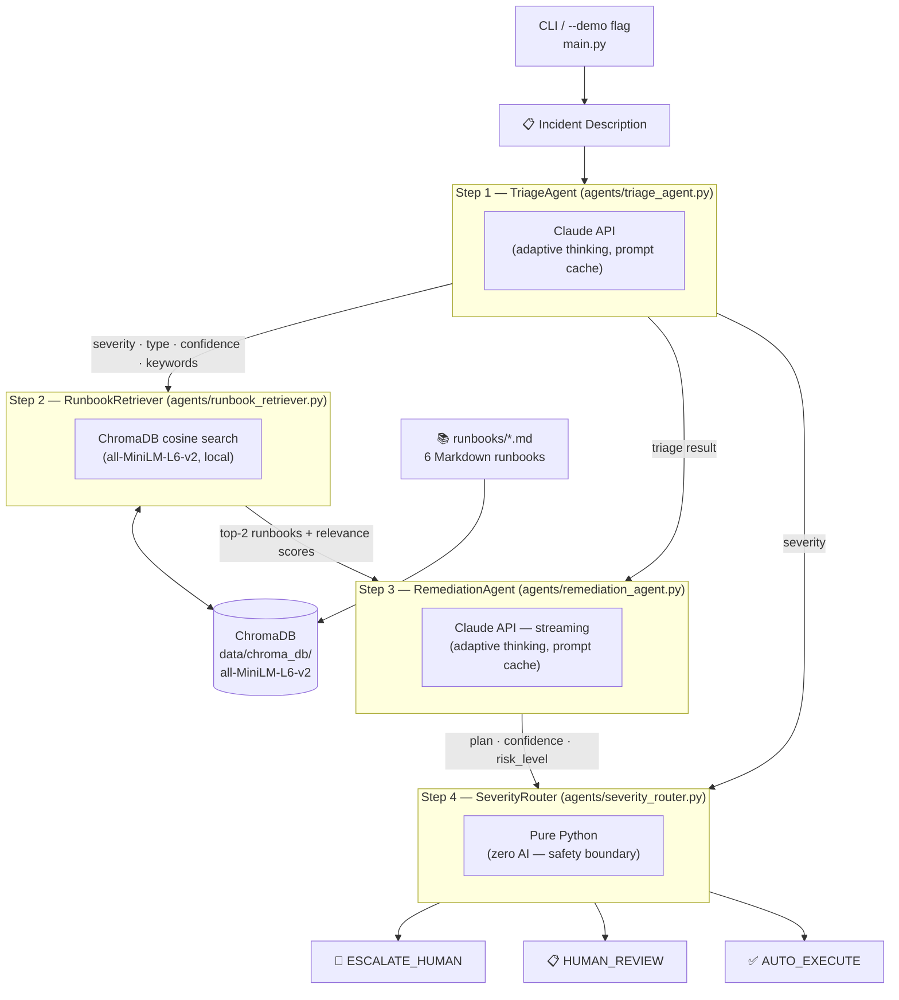

# Runbook Automation Agent — Architecture Reference

## Overview

This system automates incident response by running four agents in sequence: a **TriageAgent** that classifies an incoming incident description into a severity level (SEV1/SEV2/SEV3) using the Claude API, a **RunbookRetriever** that performs semantic search against a local ChromaDB vector store of Markdown runbooks, a **RemediationAgent** that generates a step-by-step remediation plan grounded in those runbooks using Claude (streamed), and a **SeverityRouter** that makes a fully deterministic routing decision — escalate, hold for review, or auto-execute — based purely on severity and confidence with zero model involvement. The routing layer is the critical safety boundary of the system: all escalation logic is hard-coded Python with a named threshold constant, not a prompt, ensuring it cannot be influenced by model drift or injection.

---

## Key Concepts

| Concept | Description |
|---|---|
| **Severity levels** | SEV1 = critical outage / data loss risk; SEV2 = major degradation affecting many users; SEV3 = minor / slow-moving issue with no current user impact. The TriageAgent assigns one of these plus a confidence score. |
| **Deterministic routing** | The SeverityRouter contains no model calls — it is pure Python `if/elif` logic. SEV1 always escalates, SEV2 always holds for review, and SEV3 auto-executes only when confidence strictly exceeds 0.75. This is a safety boundary: changing routing behaviour requires a code change and review, not a prompt change. |
| **SEV3 threshold** | `SeverityRouter.SEV3_THRESHOLD = 0.75`. The plan confidence must be *strictly greater than* this value to auto-execute. At exactly 0.75 the system routes to human review. The constant is intentionally named to make threshold changes visible in code review. |
| **RAG (Retrieval-Augmented Generation)** | Instead of relying on Claude's training knowledge for remediation steps, the system retrieves the most relevant runbook sections at runtime and includes them as grounded context in the remediation prompt. |
| **Semantic embeddings** | Runbooks and search queries are encoded with `sentence-transformers/all-MiniLM-L6-v2` (384-dimensional vectors, runs locally on CPU/Apple Silicon). ChromaDB stores the vectors and returns the top-K chunks by cosine similarity at query time. |
| **Persistent vector store** | ChromaDB writes to `data/chroma_db/` on disk. Runbooks are indexed once on first launch; subsequent runs skip re-embedding unless `retriever.reindex()` is called explicitly. |
| **Cosine distance → relevance** | ChromaDB returns cosine *distance* (0 = identical, 2 = opposite). The retriever converts this to a relevance score with `max(0.0, 1.0 − distance)`, normalising it to a [0, 1] range for display. |
| **Prompt caching** | Both AI agents send their system prompts with `cache_control: ephemeral`. Anthropic caches these server-side for 5 minutes, so repeated invocations within a session read the large SRE prompt from cache at ~10% of normal token cost. |
| **Adaptive thinking** | Both AI agents set `thinking: {type: "adaptive"}`. Claude decides per-request whether extended reasoning adds value. No fixed token budget is set — the model self-regulates based on task complexity. |
| **Streaming (remediation)** | The RemediationAgent uses `client.messages.stream()` + `get_final_message()` rather than a blocking `.create()` call. Remediation plans can be large; streaming prevents SDK HTTP timeouts and allows the caller to observe progress. |

---

## Pipeline Diagram



---

## Agent Descriptions

| Agent | File | Model / Tech | Input | Output |
|---|---|---|---|---|
| **TriageAgent** | `agents/triage_agent.py` | `claude-opus-4-7` (adaptive thinking, prompt cache) | Raw incident description string | `TriageResult`: severity, incident_type, confidence (0–1), keywords, summary |
| **RunbookRetriever** | `agents/runbook_retriever.py` | ChromaDB + `all-MiniLM-L6-v2` (local) | Query string built from `incident_type + keywords` | `list[RunbookResult]`: title, content, relevance_score, file_path |
| **RemediationAgent** | `agents/remediation_agent.py` | `claude-opus-4-7` (adaptive thinking, streaming, prompt cache) | `TriageResult` + `list[RunbookResult]` | `RemediationPlan`: steps, confidence, estimated_time_minutes, risk_level, prerequisites, rollback_steps, summary |
| **SeverityRouter** | `agents/severity_router.py` | Pure Python — no model | severity (str) + confidence (float) | `RoutingDecision`: action, reason, requires_human, can_auto_execute |

---

## Routing Rules

The SeverityRouter is the only component with no model involvement. Its logic is a flat `if/elif` block — not configurable via prompt or environment variable.

| Severity | Confidence | Action | Requires Human | Can Auto-Execute |
|---|---|---|---|---|
| SEV1 | any | `ESCALATE_HUMAN` | Yes | No |
| SEV2 | any | `HUMAN_REVIEW` | Yes | No |
| SEV3 | > 0.75 | `AUTO_EXECUTE` | No | Yes |
| SEV3 | ≤ 0.75 | `HUMAN_REVIEW` | Yes | No |
| Unknown | any | `ESCALATE_HUMAN` | Yes | No |

The threshold `SEV3_THRESHOLD = 0.75` lives as a named class constant in `SeverityRouter`. The boundary condition is strict (`>`): exactly 0.75 routes to `HUMAN_REVIEW`, not auto-execution.

---

## Runbook Library

| File | Incident Type | Key Topics |
|---|---|---|
| `disk_space.md` | `disk_space` | `df`, `du`, `lsof +L1`, `journalctl --vacuum`, `logrotate`, Docker prune, inode exhaustion |
| `high_cpu.md` | `high_cpu` | `top`, `ps`, `htop`, `strace`, `renice`, K8s HPA, JVM GC, coin miner detection |
| `memory_leak.md` | `memory_leak` | `free`, OOMKiller, `smaps_rollup`, `jmap`, `py-spy`, `MemoryMax`, heap dumps |
| `service_down.md` | `service_down` | `systemctl`, `docker logs`, `kubectl describe`, `kubectl rollout undo`, port conflicts |
| `network_latency.md` | `network_latency` | `ping`, `mtr`, `traceroute`, `ethtool`, MTU mismatch, DNS caching, CoreDNS |
| `database_connection.md` | `database_connection` | `pg_stat_activity`, connection pool exhaustion, `pg_terminate_backend`, PgBouncer, replica lag |

---

## Demo Scenarios

| Flag | Severity | Incident | Expected Routing |
|---|---|---|---|
| `--demo sev1` | SEV1 | Production PostgreSQL cluster — all 3 nodes down, 100% request failure, active transactions lost | `ESCALATE_HUMAN` (always, regardless of confidence) |
| `--demo sev2` | SEV2 | API service memory spike: 7.5 GB/pod, 3/8 pods OOMKilled, P99 latency 12 s, 60% requests timing out | `HUMAN_REVIEW` (always, regardless of confidence) |
| `--demo sev3` | SEV3 | Disk at 78%, growing ~2 GB/day, 11 days of runway, no user impact, log rotation misconfigured | `AUTO_EXECUTE` (SEV3 + confidence > 0.75) |

---

## Data Flow: SEV3 Disk Space Scenario

1. `python main.py --demo sev3` passes the disk space incident string to `RunbookAutomationSystem.run()`.
2. **TriageAgent** calls the Claude API with the incident text. Claude returns `{"severity": "SEV3", "incident_type": "disk_space", "confidence": 0.95, "keywords": ["disk", "78%", ...]}`.
3. **RunbookRetriever** builds a query `"disk_space disk 78% log rotation ..."`, embeds it with all-MiniLM-L6-v2, and queries ChromaDB. `Disk Space` returns with relevance ~54%; a secondary runbook is included as context.
4. **RemediationAgent** streams a plan from Claude combining triage context and the retrieved runbook. The plan includes 17 steps (diagnose → clean → verify → prevent), returns `confidence: 0.82`, `risk_level: "low"`.
5. **SeverityRouter** evaluates `route("SEV3", 0.82)`: `0.82 > 0.75` → `AUTO_EXECUTE`.
6. Rich tables render the triage result, retrieved runbooks, plan steps with commands, metadata, routing decision, and a green `✅ AUTO-EXECUTING REMEDIATION` banner.

---

## What the Agent Does and Does Not Do

The pipeline is **read and generate only** — it never executes the commands it produces.

| Action | Does the agent do this? |
|---|---|
| Read runbook `.md` files from disk | Yes — once, to build the ChromaDB index |
| Write the ChromaDB index to `data/chroma_db/` | Yes — on first run only |
| Make HTTPS calls to `api.anthropic.com` | Yes — TriageAgent and RemediationAgent |
| Run shell commands from the remediation plan | **No** |
| Modify files, restart services, or interact with the OS | **No** |

The commands inside `RemediationPlan.steps` are plain strings inside a Python dataclass — they are rendered in a Rich table and nothing more. `AUTO_EXECUTE` is a label on a `RoutingDecision` dataclass indicating the plan *met the confidence bar* to be run automatically; there is no executor wired up. Adding one would require deliberately writing new code (a `subprocess.run` loop or equivalent) after the router call in `main.py`.

---

## Configuration Reference

| Constant | Value | Location |
|---|---|---|
| Claude model | `claude-opus-4-7` | `TriageAgent.MODEL`, `RemediationAgent.MODEL` |
| Embedding model | `all-MiniLM-L6-v2` | `RunbookRetriever.EMBED_MODEL` |
| ChromaDB path | `data/chroma_db/` | `RunbookRetriever.__init__` |
| Collection name | `runbooks` | `RunbookRetriever.COLLECTION` |
| Vector distance metric | cosine | `RunbookRetriever._col` metadata |
| Runbooks retrieved per query | 2 | `RunbookAutomationSystem.run()` call to `search()` |
| SEV3 auto-execute threshold | `0.75` (strict `>`) | `SeverityRouter.SEV3_THRESHOLD` |
| TriageAgent max_tokens | 1024 | `agents/triage_agent.py` |
| RemediationAgent max_tokens | 4096 | `agents/remediation_agent.py` |

---

## Key Commands

```bash
# Install dependencies (venv recommended)
pip install -r requirements.txt

# Copy and fill in your API key
cp .env.example .env

# Run demo scenarios
python main.py --demo sev1          # SEV1 → ESCALATE_HUMAN
python main.py --demo sev2          # SEV2 → HUMAN_REVIEW
python main.py --demo sev3          # SEV3 → AUTO_EXECUTE (confidence > 0.75)
python main.py --demo all           # run all three back-to-back

# Process a custom incident
python main.py --incident "Redis cache cluster is returning CLUSTERDOWN errors on all nodes"

# Force re-index runbooks (after editing .md files)
python - <<'EOF'
from agents.runbook_retriever import RunbookRetriever
r = RunbookRetriever("runbooks", "data/chroma_db")
r.reindex()
print(f"Re-indexed: {r._col.count()} runbooks")
EOF

# Inspect the vector store
python - <<'EOF'
import chromadb
c = chromadb.PersistentClient(path="data/chroma_db")
col = c.get_collection("runbooks")
print(col.count(), "runbooks indexed")
for m in col.get()["metadatas"]:
    print(" ", m["title"], "—", m["file_path"])
EOF
```

---

## Key File Paths

```
runbook-agent/
├── main.py                              # Orchestrator + CLI (--demo sev1/sev2/sev3/all, --incident)
├── agents/
│   ├── triage_agent.py                  # TriageAgent: Claude API classification
│   ├── runbook_retriever.py             # RunbookRetriever: ChromaDB semantic search
│   ├── remediation_agent.py             # RemediationAgent: Claude API plan generation (streaming)
│   └── severity_router.py              # SeverityRouter: pure Python routing — no AI
├── runbooks/
│   ├── disk_space.md
│   ├── high_cpu.md
│   ├── memory_leak.md
│   ├── service_down.md
│   ├── network_latency.md
│   └── database_connection.md
├── data/
│   └── chroma_db/                       # ChromaDB persistent store (created on first run)
├── docs/
│   └── architecture.md                  # This file
├── requirements.txt
└── .env.example
```
